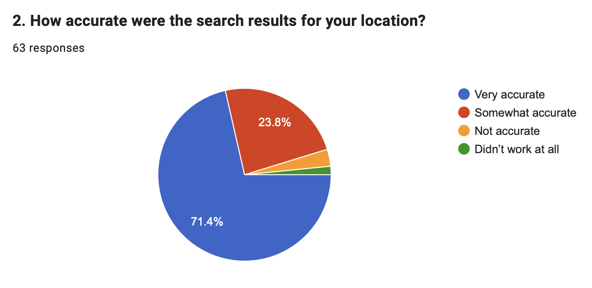
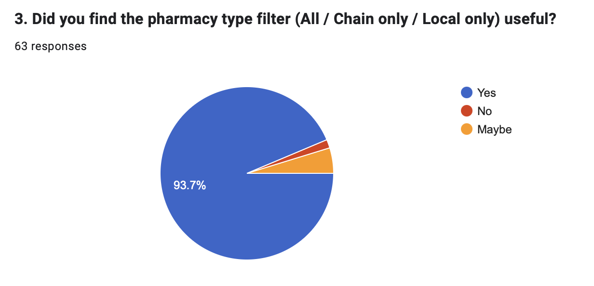
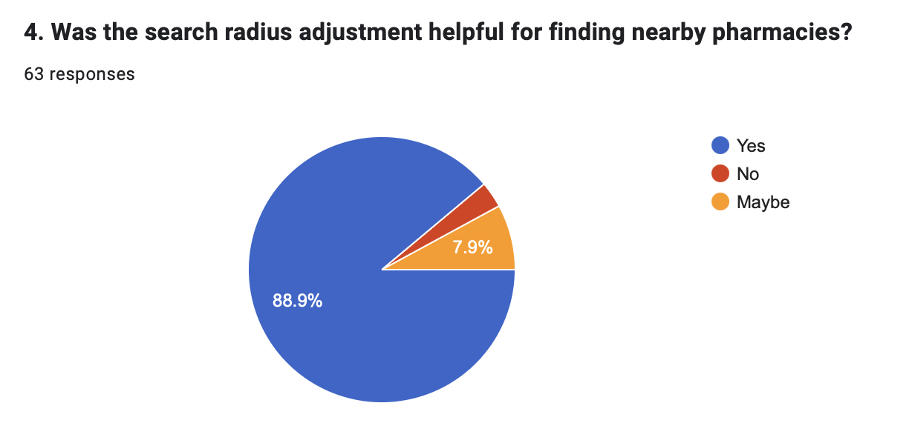
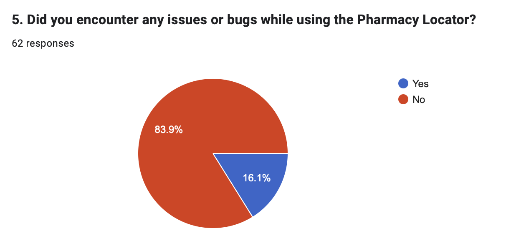

# 📊 User Experience Analytics – Generic Medicine Finder App

---

## 🟢 App Usage Insights

- **Average App Rating:** ⭐️ **4.65 / 5**
- **Clarity of Medicine Information:** 🏆 *Very clear and helpful* (most common response)
- **Ease of Searching Medicines:** 🔍 *Easy* (most common response)

---

## 🔍 Most Useful Features Identified

| Feature Combination                                      | Mentions |
|----------------------------------------------------------|----------|
| Search by Name                                           | 10       |
| Search by Formulation + Search by Name + Filters         | 9        |
| Search by Formulation + Search by Name                   | 8        |

---

## 🏥 Pharmacy Locator Insights

- **Average Ease of Finding Pharmacies:** 📍 **4.40 / 5**
- **Accuracy of Search Results:** ✔️ *Very accurate* (most common)
- **Users Who Found Filter Useful:** ✅ **93.7%**
- **Users Who Found Radius Adjustment Helpful:** 🗺️ **88.9%**
- **Users Reporting Locator Issues:** ⚠️ **15.9%**

---

## 📈 Visual Analytics

### ✅ Accuracy of Location-Based Search Results

---

### 🧭 Usefulness of Pharmacy Type Filter

---

### 📍 Helpfulness of Radius Adjustment

---

### ⚠️ Issues or Bugs Encountered

---

> ℹ️ *Charts are based on 62–63 survey responses collected from app users.*
