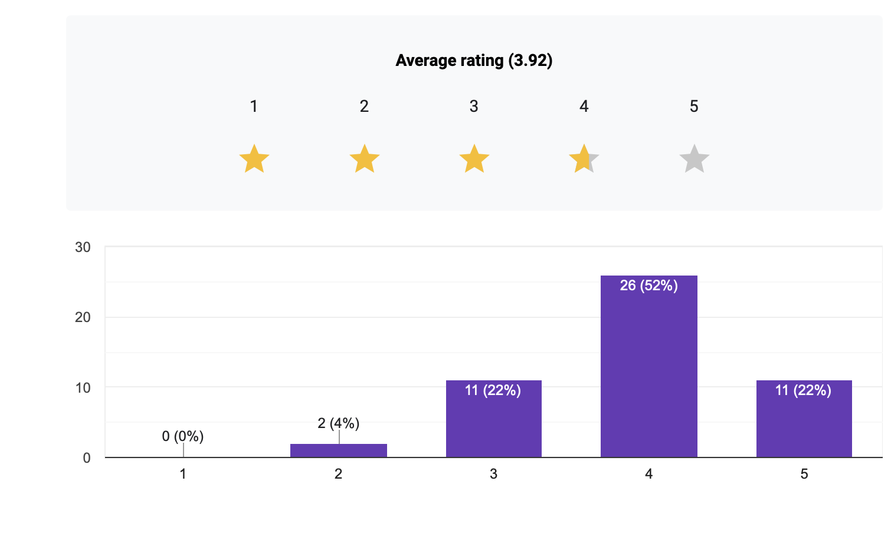
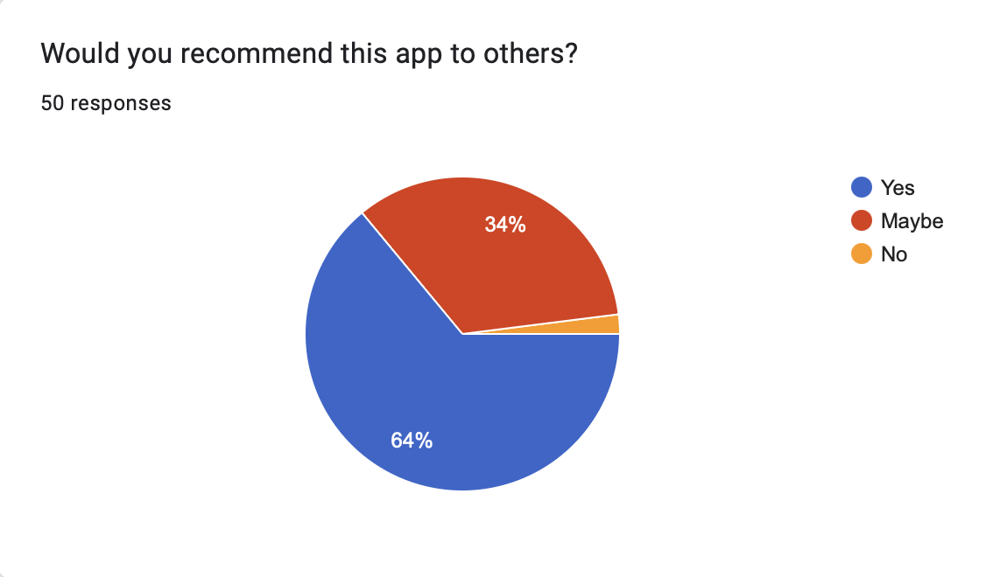
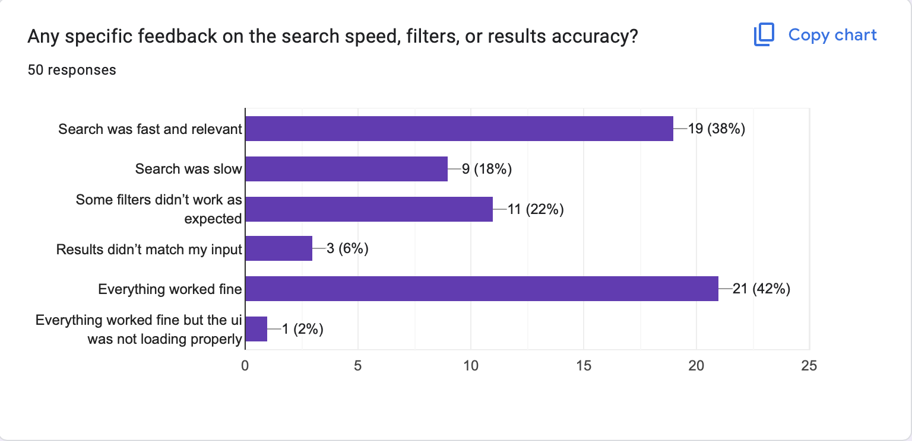
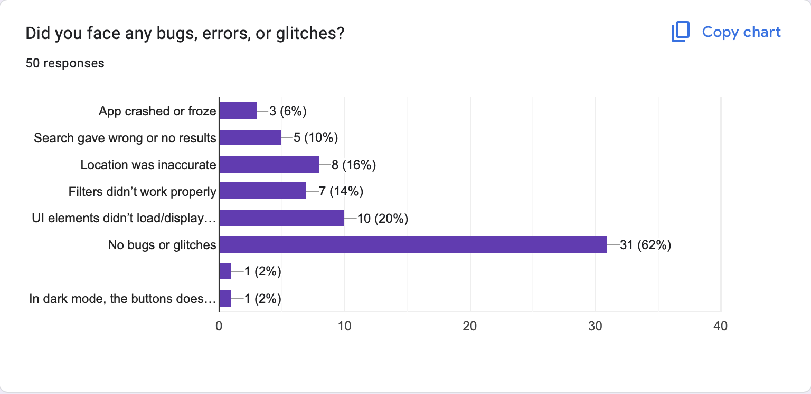
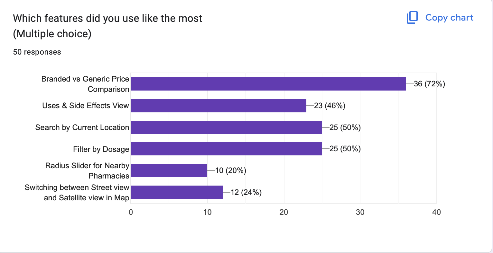
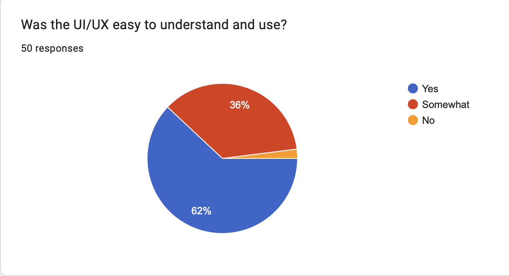

# 📊 Detailed User Feedback Analytics Report

**Total Responses Analyzed:** 50  
**Average Rating:** 3.92 / 5  

---

## 🧠 UI/UX Experience

- **Easy to Use:** 31
- **Somewhat Understandable:** 18
- **Difficult to Use:** 1

---

## 🌟 Would You Recommend This App?

- 👍 Yes: 32
- 🤔 Maybe: 17
- 👎 No: 1

Over **96%** of users are likely to recommend the app, showing strong potential for organic growth.

---

## 💡 Features Liked the Most

- **Branded vs Generic Price Comparison** — 36 users
- **Search by Current Location** — 25 users
- **Filter by Dosage** — 25 users
- **Uses & Side Effects View** — 23 users
- **Switching between Street view and Satellite view in Map** — 12 users
- **Radius Slider for Nearby Pharmacies** — 10 users

The **price comparison** and **location-based search** were the most appreciated features, followed by side effect information and filtering options.

---

## 🐞 Bugs & Glitches Reported

- No bugs or glitches — 31 reports
- UI elements didn’t load/display well — 10 reports
- Location was inaccurate — 8 reports
- Filters didn’t work properly — 7 reports
- Search gave wrong or no results — 5 reports
- App crashed or froze — 3 reports
- In dark mode, the buttons didn’t display properly — 1 report

About **62%** reported no issues. Common problems included map loading delays, dark mode UI glitches, and occasional filter failures.

---

## 🔮 Feature Suggestions — Categorized

### 🔍 Search & Accuracy
- Improve location accuracy and radius
- Add more areas (e.g., Kondapur)
- Save search history
- 24/7 pharmacy filter
- Stock checker and availability alerts

### 💊 Medicine Information
- Detailed dosage guidance
- Usage methods and formulations
- Manufacturer info and substitutes

### 🎨 UI/UX Improvements
- Better layout arrangement
- Responsive design, dark mode
- Non-Streamlit professional UI

### 🤖 AI & Voice Integration
- Voice-based search
- Chatbot support
- Smart prescription scanner
- Reminder alerts
- Personalized suggestions
- Doctor consultation integration

### 🏥 Pharmacy & Availability
- Real-time stock info
- Nearby pharmacy expansion
- Upload prescriptions
- Filter by emergency services

### 🧩 Miscellaneous
- Emergency contact access
- Nearest hospitals locator
- Workflow-based suggestions
- Advanced analytics features

---

## 🚀 Performance Feedback (User Insights)

Representative responses regarding search speed, filter performance, and result relevance:

- Search was fast and relevant  
- Some filters didn’t work as expected  
- Everything worked fine  
- Search was slow  
- Results didn’t match input  
- UI was not loading properly  
- Everything worked fine  
- Search was fast and relevant  
- Some filters didn’t work as expected  
- Everything worked fine  

---

## 📈 Visual Summary (Charts)

### ⭐ Average App Rating  

### 🌟 Would You Recommend This App?  

### 🚀 Feedback on Search, Filters, or Accuracy  

### 🐞 Bugs, Errors, or Glitches  

### 💡 Most Liked Features  

### 📊 Was the UI/UX easy to understand and use?  

---